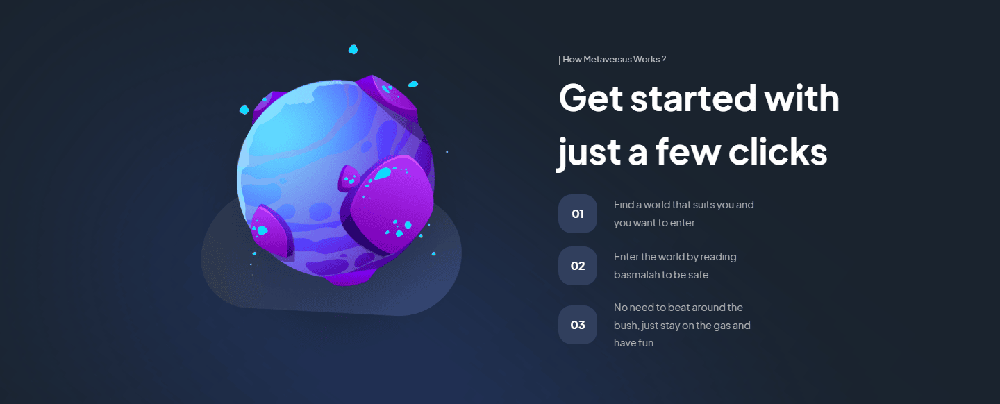

# 🗺️ Metaversus

### a Fully Responsive website with a modern UI/UX and beautiful animations using Framer-motion

## Link 🔗 [https://charactermi.github.io/metaversus](https://charactermi.github.io/metaversus)

 

# Preview

 

# Mobile Responsive

# Technologies

<ul>
    <li>
        
    </li>
    <li>
        
    </li>
    <li>
        
    </li>
    <li>
        
    </li>
    <li>
        
    </li>
    <li>
        
    </li>
</ul>
